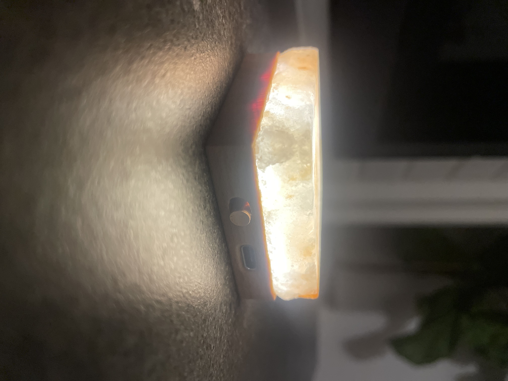

# SaltGlow

A portable saltlamp for camping, reading, or just setting the mood. 

Simple materials for modern living: Salt, Copper, Wood. 

Features: \
-USBC rechargable in less than 2 hours (100 minutes) (dumb charger only)\
-11 hour battery life - Max Brightness\
-about 5.5 days battery life - Low Brightness\
-3 Brightness Settings\
-Simple Materials\
-Each Lamp is Unique\
-Hand Assembled and Salt Selected\
-Designed in USA\
-Small Batch\
